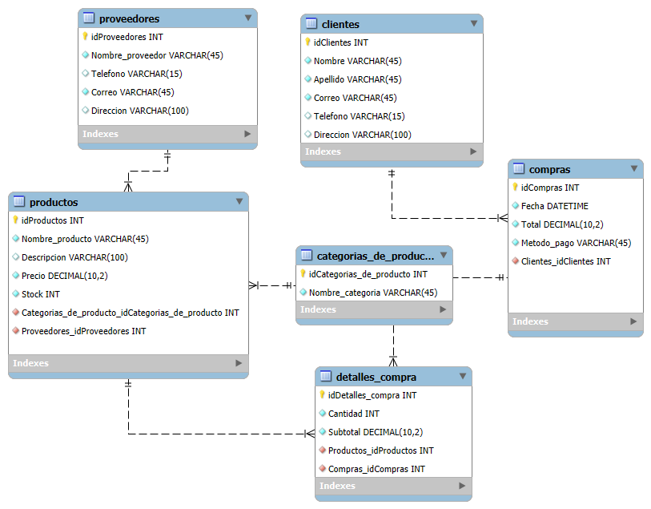

# App-PetShop-Tu Tienda de Mascotas Digital 🐶

## Introduccion
***PetShop App*** es una tienda en línea dedicada a ofrecer lo mejor en alimentos, accesorios, prendas y juguetes para mascotas.
Nuestra plataforma está diseñada para hacer las compras rápidas y sencillas, brindando productos de alta calidad. 
Con una interfaz fácil de usar, podrás encontrar todo lo que tu mascota necesita. 
Ya sea para consentir o cuidar, tenemos lo que buscas. ¡Haz que tus amigos peludos vivan mejor con ***PetShop App***!

## Propósito
***PetShop App*** tiene como propósito ofrecer una experiencia de compra eficiente y accesible para los dueños de mascotas, proporcionando productos de calidad como alimentos, accesorios, prendas y juguetes.
Queremos facilitar la vida de nuestros usuarios, permitiéndoles encontrar rápidamente todo lo necesario para consentir y cuidar a sus mascotas. 
Nos enfocamos en mejorar el bienestar de los animales, ofreciendo solo artículos que contribuyan a su salud y felicidad. 
Además, buscamos simplificar la gestión de inventarios y la experiencia de compra, brindando una plataforma intuitiva y fácil de usar.

## Objetivos

- ***Ofrecer productos de alta calidad:*** Garantizar que todos los productos, como alimentos, accesorios, prendas y juguetes, cumplan con altos estándares de calidad para satisfacer las necesidades de las mascotas.

- ***Proveer una experiencia de compra sencilla y rápida:*** Diseñar una interfaz intuitiva que permita a los usuarios encontrar fácilmente los productos que buscan y completar sus compras sin complicaciones.

- ***Promover el bienestar de las mascotas:*** Enfocarse en mejorar la salud, felicidad y calidad de vida de las mascotas mediante productos que contribuyan positivamente a su cuidado.

- ***Facilitar la gestión de inventarios para los dueños de negocios:*** Ofrecer herramientas digitales para que los dueños de tiendas de mascotas puedan simplificar la administración de sus inventarios.

- ***Fomentar la fidelidad del cliente:*** Construir relaciones duraderas con los usuarios a través de un excelente servicio al cliente y productos confiables que satisfagan sus expectativas.

- ***Brindar accesibilidad para todos los usuarios:*** Asegurar que la plataforma sea accesible desde cualquier dispositivo y lugar, permitiendo a los clientes realizar compras en cualquier momento.

- ***Generar conciencia sobre el cuidado responsable de las mascotas:*** Incluir información educativa sobre el cuidado de mascotas, promoviendo prácticas responsables entre los dueños.

- ***Expandir la oferta de productos:*** Incorporar nuevos artículos innovadores para diversificar la gama de productos disponibles y atender las demandas del mercado.

## Contexto del Problema
 ### Definición del problema
El mercado de productos para mascotas ha experimentado un rápido crecimiento, pero la oferta de tiendas en línea especializadas en ofrecer una experiencia de compra eficiente y accesible es aún limitada en muchos mercados. Muchos dueños de mascotas encuentran difícil encontrar productos de calidad en una sola plataforma, lo que lleva a una experiencia de compra fragmentada y a veces confusa. Además, la falta de información centralizada sobre productos y el cuidado de mascotas hace que los dueños no siempre tomen las mejores decisiones para el bienestar de sus animales.

En este contexto, surge la necesidad de una plataforma digital diseñada para facilitar el acceso a alimentos, accesorios, prendas y juguetes de calidad para mascotas, con un sistema intuitivo y con soporte para la gestión de inventarios, lo cual permitirá mejorar la experiencia de compra tanto para los usuarios como para los dueños de negocios.

 ### Justificación del proyecto
Desarrollar una plataforma de tienda en línea para productos de mascotas contribuye a resolver el problema de la dispersión de información y la dificultad de encontrar productos adecuados. A través de una plataforma de fácil acceso y navegación, PetShop App ofrecerá una experiencia optimizada de compra, enfocándose en el bienestar de las mascotas y promoviendo la fidelidad del cliente. Al facilitar una administración más eficiente de inventarios para dueños de tiendas, se mejorará la disponibilidad de productos y se fortalecerá la relación con los usuarios.

## Análisis de requerimiento
El proyecto busca ser una tienda en línea que ofrezca productos para el cuidado de las mascotas, garantizando la facilidad de compra y un servicio de calidad. Es esencial que la plataforma sea accesible, intuitiva y cuente con herramientas que mejoren tanto la experiencia del cliente como la gestión del inventario de los negocios. A continuación, se presenta un análisis detallado de los requisitos funcionales y no funcionales que debe cumplir el sistema.

 ## Funcionalidades Clave:
 
### 1. Productos de Alta Calidad:

La aplicación ofrece una amplia gama de productos de alta calidad para mascotas, como alimentos, accesorios, prendas y juguetes, garantizando que cumplan con los estándares más altos para asegurar la salud y felicidad de las mascotas.

***Selección de productos variados:*** Todos los productos están organizados en categorías fáciles de explorar, garantizando que los usuarios encuentren lo que necesitan rápidamente.

***Descripciones detalladas:*** Cada producto tiene información clara sobre sus características, beneficios y recomendaciones, ayudando al usuario a tomar decisiones informadas.

### 2. Navegación Intuitiva:

La interfaz de la aplicación está diseñada para ser fácil de usar, permitiendo a los usuarios navegar sin esfuerzo, encontrar productos rápidamente y completar sus compras sin complicaciones.

***Búsqueda avanzada y filtrado:*** Los usuarios pueden buscar productos por categoría, marca, precio y necesidades específicas de la mascota.

***Diseño claro y organizado:*** El contenido se presenta de forma estructurada, con categorías y subcategorías claras que guían al usuario en su proceso de compra.

### 3. Gestión de Inventarios para Dueños de Tiendas:

PetShop App proporciona herramientas digitales que permiten a los dueños de tiendas de mascotas gestionar su inventario de manera eficiente, manteniendo un control actualizado de los productos disponibles.

***Sistema de alertas:*** Notificaciones que avisan sobre productos agotados o próximos a agotarse, facilitando la reposición de inventario.

***Control de stock:*** Visualización en tiempo real del nivel de existencias de cada producto.

### 4. Educación y Promoción del Bienestar Animal:

La aplicación incluye secciones educativas sobre el cuidado responsable de las mascotas, proporcionando artículos, consejos y recomendaciones para los dueños.

***Artículos informativos y videos:*** Consejos sobre salud, nutrición y comportamiento animal.

***Promociones de productos relacionados:*** Sugerencias de productos que complementen los cuidados básicos de las mascotas.

### 5. Experiencia de Compra Rápida y Sencilla:

PetShop App asegura que los usuarios puedan completar sus compras con facilidad.

***Carrito de compras funcional:*** Un sistema de carrito que permite agregar productos rápidamente y revisar los detalles de la compra antes de finalizar.

***Opciones de pago seguras:*** Métodos de pago variados y seguros que garantizan una experiencia de compra sin problemas.

### 6. Accesibilidad Multiplataforma:

La aplicación está diseñada para ser accesible desde cualquier dispositivo, lo que permite a los usuarios realizar compras en cualquier lugar y en cualquier momento.

***Diseño responsivo:*** La plataforma se adapta a dispositivos móviles, tabletas y computadoras de escritorio.

***Aplicación móvil disponible:*** PetShop App contará con una versión para smartphones que permite realizar compras de manera eficiente y práctica.

### Impacto de funcionalidades

Estas funcionalidades están pensadas para mejorar tanto la experiencia del usuario como la gestión para los dueños de negocios. Al ofrecer productos de calidad, facilitar la compra y educar a los usuarios, PetShop App busca convertirse en una herramienta indispensable para los amantes de las mascotas y los comercios dedicados a este sector, mejorando la calidad de vida de los animales y satisfaciendo las expectativas de los dueños.

## Modelo Relacional en Mysql

## Tablas principales
***1. Proveedores:***
Almacena información sobre las entidades que suministran los productos que se venden o distribuyen.
***2. Clientes:***
 Almacena información sobre las personas o empresas que adquieren productos o servicios.
***3. Productos:***
 Almacena información sobre los bienes que están disponibles para la venta o distribución.
***4. Categoría de productos:***
 Almacena información que clasifica los productos en diferentes grupos o tipos.
***5. Compras:***
 Almacena los registros de las transacciones realizadas para adquirir productos de los proveedores.
***6. Detalles de compra:***
 Almacena información específica sobre cada producto incluido en una compra, como cantidades y precios.
